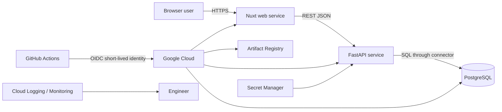
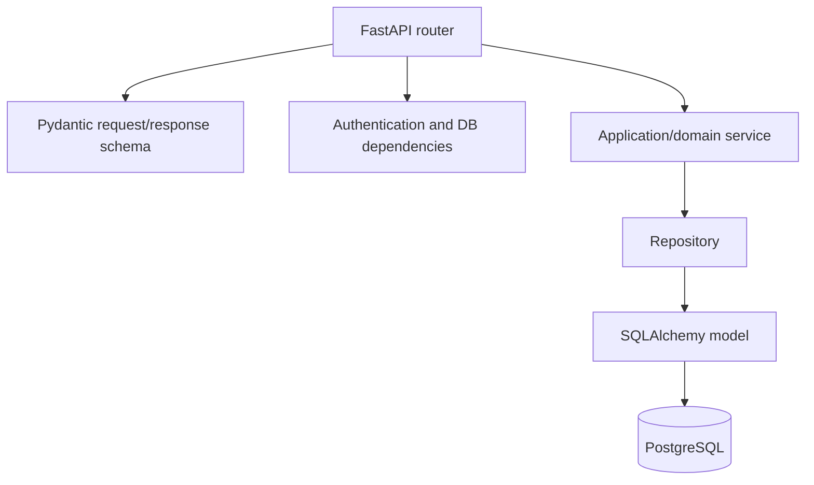
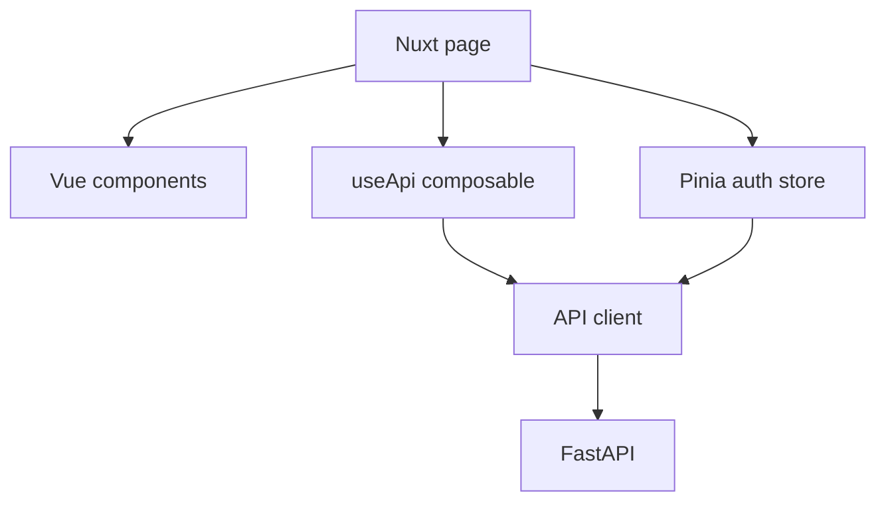

# Architecture

## Context

Workboard is a modular monolith split into two independently deployable web services and one managed relational database. The split is operational, not microservice-driven:

- the Nuxt service owns HTML rendering, browser interactions, and frontend runtime configuration;
- the FastAPI service owns external API contracts, authentication, authorization, business rules, and persistence coordination;
- PostgreSQL owns durable relational state and constraints.

The architecture is intentionally small enough to trace end to end. It avoids queues, caches, Kubernetes, and service-to-service meshes until the learner can operate the base system.

## System context



## Deployment view

### Local development

```text
Docker Compose project
├── db        postgres:17-alpine + named volume
├── backend   FastAPI development target + bind-mounted source
└── frontend  Nuxt development target + bind-mounted source/node_modules volume
```

The browser calls `localhost:8000`; server-side Nuxt rendering calls Docker DNS name `backend:8000`. This difference teaches public versus internal runtime endpoints.

### Acceptance environment

```text
compose.test.yaml
├── db-test        isolated PostgreSQL without host port
├── backend-test   production image, migrations, deterministic seed
├── frontend-test  production Nuxt image
└── e2e            version-matched Playwright image
```

The stack is ephemeral. The E2E container exits with the acceptance result, and Compose tears down the database volume.

### Google Cloud

```text
Artifact Registry
├── workboard-backend:<git-sha>
└── workboard-frontend:<git-sha>

Cloud Run
├── workboard-api      backend service
├── workboard-web      frontend service
└── workboard-migrate  on-demand migration job

Cloud SQL for PostgreSQL
Secret Manager
├── workboard-database-url
└── workboard-secret-key
```

## Backend layers



### Router

Owns HTTP paths, methods, dependency declarations, status codes, and response schemas. It should not contain SQL or multi-step business decisions.

### Schema

Defines external data contracts and boundary validation. A schema is not the database model and should not expose internal fields by accident.

### Service

Coordinates business rules and transactions. Examples: unique project slug generation, membership/ownership checks, valid task transitions, password registration flow.

### Repository

Encapsulates query mechanics and persistence operations. It does not decide whether a user is allowed to perform the business action unless the query itself is a resource-scoping mechanism requested by the service.

### Model

Represents persisted tables, relationships, enum values, timestamps, and constraints.

## Frontend layers



### Page

Owns route-level data and composition. Public pages may execute data fetching during server rendering.

### Component

Owns a focused UI contract through props, events, semantic markup, and local state. Components should not duplicate authentication or transport behavior.

### Composable/service

Owns reusable request behavior and access to runtime configuration. Raw `$fetch` calls should not be scattered through unrelated components.

### Store

Owns genuinely shared authentication state. Project/task server data remains page-local in the reference implementation because no cross-page cache requirement exists.

## Request sequence: authenticated task creation

```mermaid
sequenceDiagram
  participant B as Browser
  participant N as Nuxt
  participant F as FastAPI
  participant S as TaskService
  participant R as Repositories
  participant P as PostgreSQL

  B->>N: Submit task form
  N->>F: POST /api/v1/projects/{id}/tasks + Bearer token
  F->>F: Decode access token and load current user
  F->>S: create(project_id, payload, user_id)
  S->>R: Verify project access
  R->>P: SELECT project/member
  S->>R: Persist task
  R->>P: INSERT task; COMMIT
  F-->>N: 201 TaskRead JSON
  N-->>B: Add task to visible list
```

## Configuration boundaries

| Setting | Local source | Production source | Consumer |
|---|---|---|---|
| Database URL | Compose environment | Secret Manager | backend/job |
| Signing key | Compose local value | Secret Manager | backend |
| Browser API base | Compose environment | Cloud Run environment | Nuxt client runtime |
| Internal API base | Docker DNS | backend Cloud Run URL | Nuxt server runtime |
| CORS origins | explicit localhost list | deployed frontend origin | backend |
| Cookie secure flag | false | true | backend |

Secrets must never be passed as Docker build arguments or embedded in Nuxt public runtime configuration.

## Scalability and state

Backend and frontend containers are stateless. Multiple instances may serve traffic because durable state is in PostgreSQL and tokens carry identity. The demonstration refresh-token design does not include revocation storage, device tracking, or reuse detection; those are production follow-ups.

Cloud SQL connection limits must be considered before raising Cloud Run maximum instances. Each instance can create a connection pool; unbounded application pools multiplied by autoscaling can exhaust the database.

## Failure boundaries

- **Frontend unavailable:** API may remain healthy; browser cannot access product UI.
- **Backend unavailable:** public SSR and authenticated workflows fail; frontend health endpoint may still respond.
- **Database unavailable:** backend readiness fails; liveness remains available; API operations fail.
- **Migration failure:** deployment stops before application revisions update.
- **Bad backend revision:** Cloud Run can shift traffic to prior backend revision; schema compatibility determines safety.
- **Bad frontend revision:** frontend traffic can roll back independently.

## Deliberate omissions

The reference does not include email delivery, password reset, multi-factor authentication, invitation workflow, advanced roles, audit log, rate limiter, cache, object storage, WebSockets, background jobs, custom domain, CDN, WAF, private IP networking, or full distributed tracing. Each omission is an opportunity for an advanced extension only after the base objectives are demonstrated.
